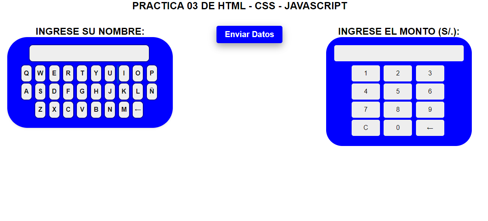

# Senati-Practica-03 (HTML - CSS - JS)

FUNDAMENTOS DE LA PROGRAMACION WEB

# EJERCICIO 1
### Realizaremos un aplicacion donde tendremos accesos con usuario y contraseña, luego entraremos a la pagina principal donde ingresaremos Nombre y Monto de la persona o cliente

1. Creen un archivo llamado "script.js".
2. Dentro del archivo script.js, realizaremos los siguiente requisitos: 

3. Crear Pop-Ups en Javascript - Utilizaremos el <b>alert</b> simplemente un mensaje de alerta que avisara al usuario, que primero debe identificarse;
   ```
   alert("¡ALTO AHI! ¡IDENTIFIQUESE INTRUSO!");
   ```
4. Crear Pop-Ups en Javascript - Utilizaremos el <b>promt</b> donde el usuario ingresara su usuario y contraseña.
   ```
   prompt("Ingresa el usuario");
   prompt("Ingresa la contraseña");
   ```
5. Crearemos las variable y lo almacenamos dentro de ellas los <b>promt</b> (Pop-Ups).
   ```
   let identificarUser
   let identificarClave
   ```
6. Ahora lo que tenemos que hacer es: Utilizaremos una condicional <b>if()else{}</b> en Javascript, donde usaremos las variables que creamos anteriormente y hacemos un condicional donde  le preguntamos si son iguales los datos ingresado (usuario y contraseña), si el usuario ingreso los datos correctos entonces ingresara al sistema y si en caso contrario no ingreso, actualizara de forma automatica la pagina hasta que ingrese los datos correcto.
   
  ```
 if(){
     alert("USTED HA SIDO INDENTIFICADO, AHORA TIENES ACCESO A LOS SISTEMAS")
 }else{
     alert("¡ACCESO DENEGADO!")
     location.reload() // Se actualizara la pagina hasta que ingrese los datos correctamente
 }
 ```

7. Ahora programamos las funciones, Primero hacemos la funcion del formulario donde tenemos que "Ingresar el nombre".
  ```
  /*=================== PROGRAMANDO LA CAJA DE "INGRESE SU NOMBRE" ===================*/
  function agregarPalabras(atributos){
      console.log(atributos) //podemos ver que resultado sale en el navegador mendiante uso de console.log,
      
  }
  ```

7.1 Ahora programamos otra funcion donde nos permita borrar ( ←  )cada palabra de la caja pantalla en el formulario "Ingresar el nombre".
    copiar y pegar  este codigo en tu proyecto, no lo modifiquen, dejalo como esta.
    Utilizaremos el metodo ```.slice```. Este método es útil cuando deseas quitar o reemplazar el último carácter de una cadena sin modificar la cadena original.
    Ejemplo: 
  ```
  function borrarCadaPalabras(){
     /*
      slice = para obtener una subcadena del contenido de texto.
      //slice (0 , ) positicion cero, hasta la posicion que digamos que eliminar que seria el ultimo caracter(-1)
      pantalla.textContent = pantalla.textContent.slice(0, -1)
     */
      let pantallaPalabras =  document.getElementById('pantalla');   //Colocamos en un variable
      pantallaPalabras.value = pantallaPalabras.value.slice(0, -1);  
      return // fin o retornar - significa que no volveremos a usar
  }
  ```
8. Ahora programamos la caja de formulario donde dice "Ingresar monto (S/.).
9. Utilizaremos las siguientes funciones.
     ```
     /*=================== PROGRAMANDO LA CAJA DE "INGRESE EL MONTO EN SOLES"===================*/
     function agregarNumber(atributos){
         
     }
     
     
     function borrarTodoNumber(){
         
     }
     
     function borrarCadaNumber(){
       
     }
     ```

10. Programamos un funcion del "BOTON ENVIAR", dicha funcion nos mostrara  <b>alert</b> simplemente un mensaje de alerta que avisara al usuario el "NOMBRE DE LA PERSONAS Y EL MONTO EN SOLES"
     ```
      valorPantallaNumero
      valorPantallaPalabra
      alert("El nombre de la Persona es: "+ valorPantallaPalabra + "\n"+"El monto es que se enviara es: S/."+valorPantallaNumero );
     ```
<hr>


¡Ojo! Recuerda para poder tener los valores de un <b> input type="text" </b> tenemos que usar este codigo.
    Ejemplo:
    
 ```
<input type="text" class="mi_idenfiticador_mediante_class">
document.getElementsByClassName('mi_identificador_mediante_class')[0].value.

<input type="text" id="mi_idenfiticador_mediante_ID">
document.getElementById('mi_identificador_mediante_ID').value
 ```
    
¡Ojo! Es recomendable poner una variable y  almacenarlo, asi poder usar independientemente y acceder a ella mas fácil. Ejemplo
    
   ```
   let variableAlmanceneroCLASES = document.getElementById('mi_idenfiticador_mediante_class');
   let valorPorClase = variableAlmanceneroCLASES[0].value;
   console.log("Valor por clase: " + valorPorClase);
   
   let variableAlmanceneroID = document.getElementById('nombre_de_mi_ID');
   var valorPorID = variableAlmanceneroID.value;
   console.log("Valor por ID: " + valorPorID);
   ```
    
<hr>



